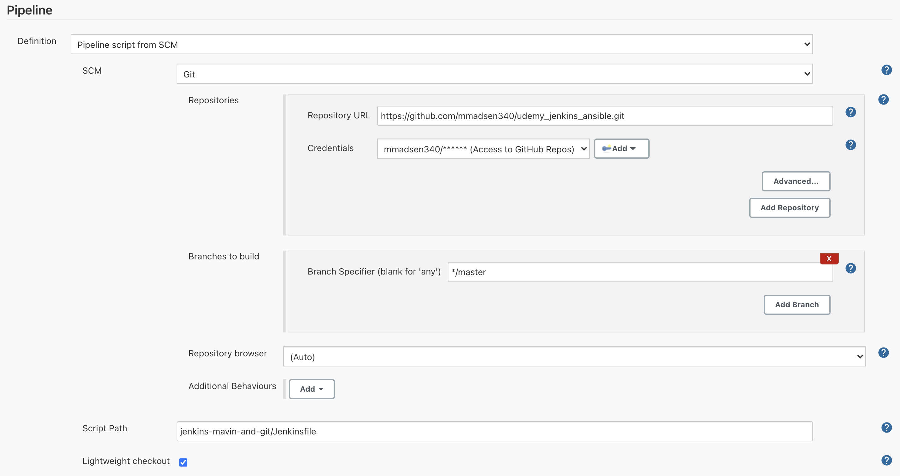

## First Maven Build
This sub-repo is my first maven build using Jenkins

For this to work the Jenkins file must have the -f <file path> to point mvn to the right location of the pom.xml

### Prereqs
The following image shows the setup in Jenkins
